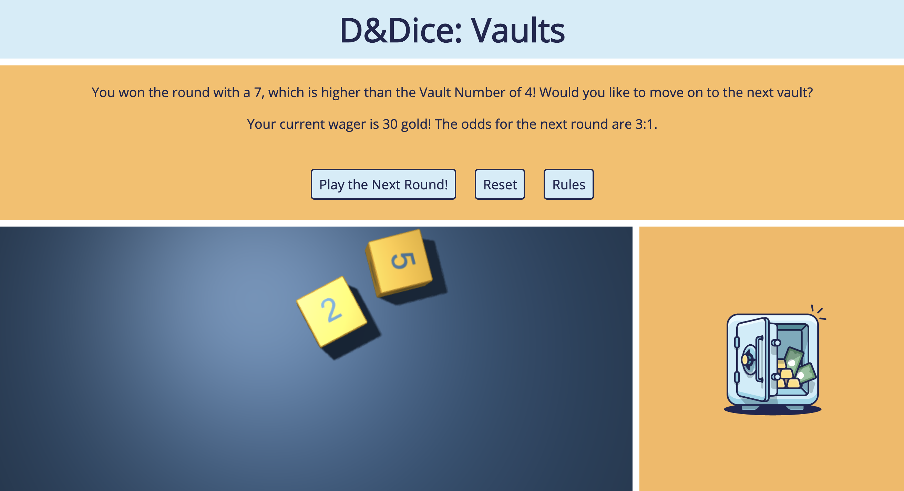

# DandDice
### Bringing Faerun's Most Beloved Dice Games to Your Browser
Dungeons and dragons dice game for GA Project #1. The game currently only allows for Vaults and Giants and Halflings, but Pickpocket is next on the list.

### Getting Started
You can find Vaults [here](https://meeschka.github.io/DandDice/). 

### Rules of Play - Vaults
After the player makes their wager, the house roles the first die, an eight-sided die (d8). This is the difficulty of the vault. If the house rolls a 1, the vault is a mimic and the player loses immediately.

The player rolls two six-sided dice (2d6), trying to roll over the vault number. If the player rolls double 1s or the vault number exactly, they activate the trapdoor, passing immediately to the second vault without winning anything from the second. (In some variants, this only applies to double ones). If the player rolls a 9 or higher, they activate the trap and lose.

Players who win a round of vaults move on to the next vault. Successive rounds are harder as the vault die is larger (progressing to 1d10, 1d12, and finally 1d20), but the payout is also larger. The table below shows the payout on the original bet, and the trap numbers (if any).

On the final vault, the player has the option of taking a crowbar. This means they can add an additional four-sided die (1d4) to their roll, but the payout amount is reduced.

Vault Level | Vault Die | Player Die | Payout | Trap #
------------|-----------|------------|--------|--------
Vault 1   |    1d8    |    2d6     |   1:1  |   9+
Vault 2   |    1d10   |    2d6     |   2:1  |   11+
Vault 3   |    1d12   |    2d6     |   3:1  |   no trap 
Vault 4   |    1d20   |    2d6     |   5:1  |   no trap 
Vault 4 + crowbar  |    1d20   | 2d6 + 1d4  |   4:1  |   no trap

A player can choose to walk away after completing any vault. All winnings from the game are automatically wagered at the next vault if the player decides to continue.

If the rules seem complicated, don't worry! The game will prompt you with the next steps and the win conditions in the message section.

#### Variants
 Giants and halflings is a little like a single round of vaults where the number to beat is rolled on 1d10, and there is the option to split if the knee (vault number) is met exactly or push if you roll two 1s. When splitting, the initial wager is doubled, and the player rolls one additional die for each die rolled originally. Currently, the game does not allow recursive splitting.

Pickpocket has the same rules as G&H, except you don't exceed the knee to win. The knee pays 5-1, adjacent numbers 1:1, and two away pushes. 11 and 12 lose. For example on a purse of four, 3 and 5 pay 1-1. 2 and 6 push. 11-12 is "the watch," 1 is "the sap", and the ärgert number is "the purse". Variant rules can be found [in this discussion](https://www.reddit.com/r/TheCTeam/comments/6lkeij/giants_and_halflings/).

### Screenshots

### Technologies Used
This game uses HTML, CSS, Javascript and Jquery for the main game logic. The 3D Dice Roller was modified from Anton Natarov's [free dice roller](http://www.teall.info/2014/01/online-3d-dice-roller.html), and uses the Three JS library for 3D graphics and Cannon JS as a physics engine.

### Credits
Vaults and it's associated variants were created by Jerry Holkins of Penny Arcade. Additional variants and specific ruleset were based on [this subreddit discussion](https://www.reddit.com/r/TheCTeam/comments/7ia630/giants_and_halflings_pickpocket_and_vaults/).
The 3D Dice Roller was created using Anton Natarov's [free dice roller](http://www.teall.info/2014/01/online-3d-dice-roller.html).
Vault graphics are from the [open source illustration kit by Vijay Verma](https://illlustrations.co/).

### TO DO
* add option to play pickpocket
* make game responsive for phone-sized devices
* allow players to split multiple times in Giants and Halflings
* Find alternate images for Giants and Halflings, Pickpocket, Mimics
